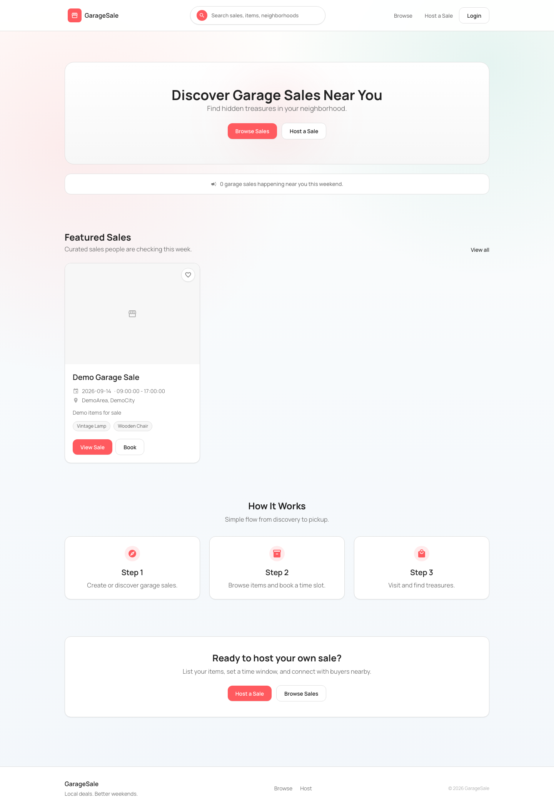
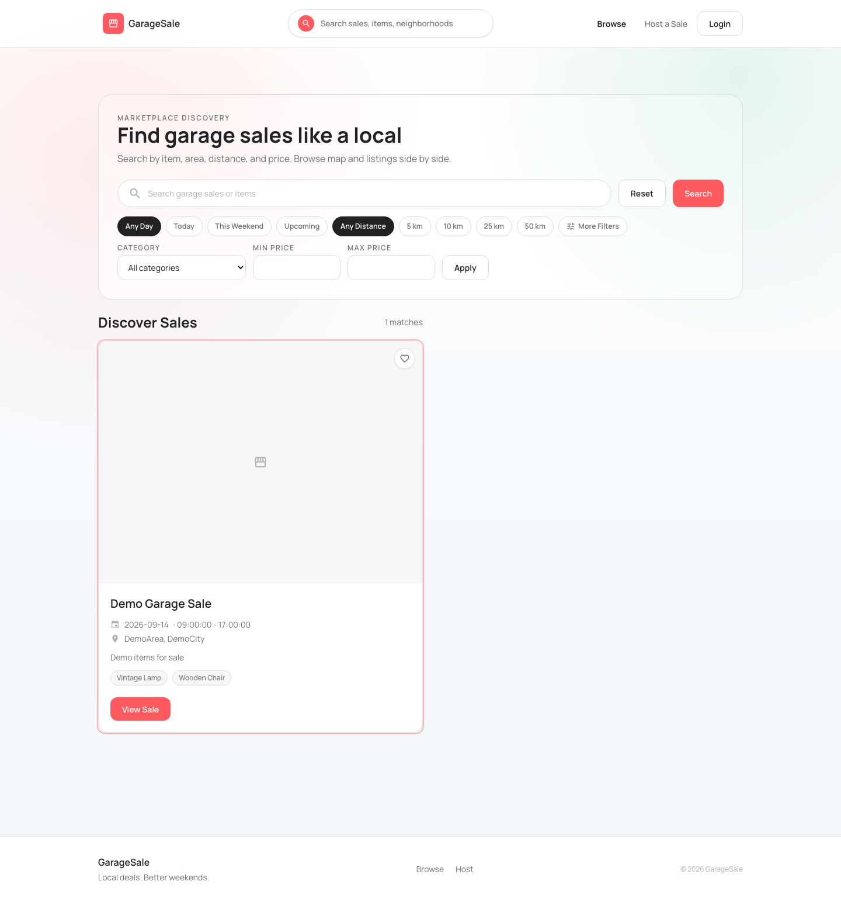
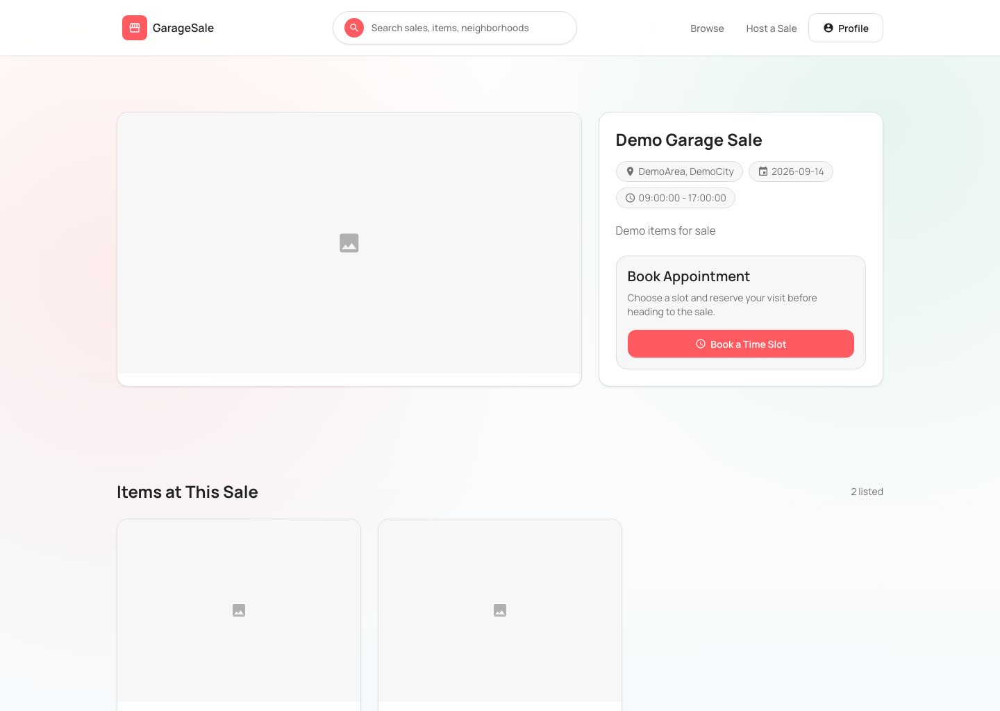
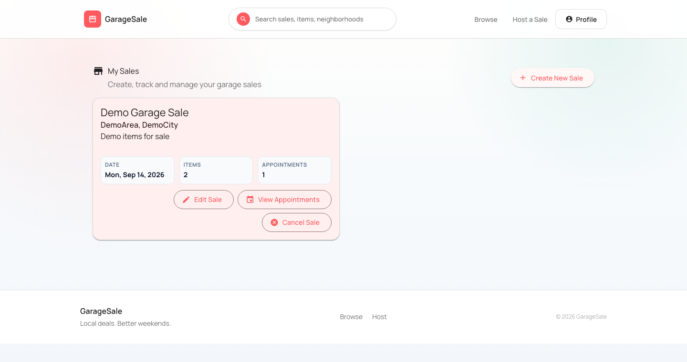
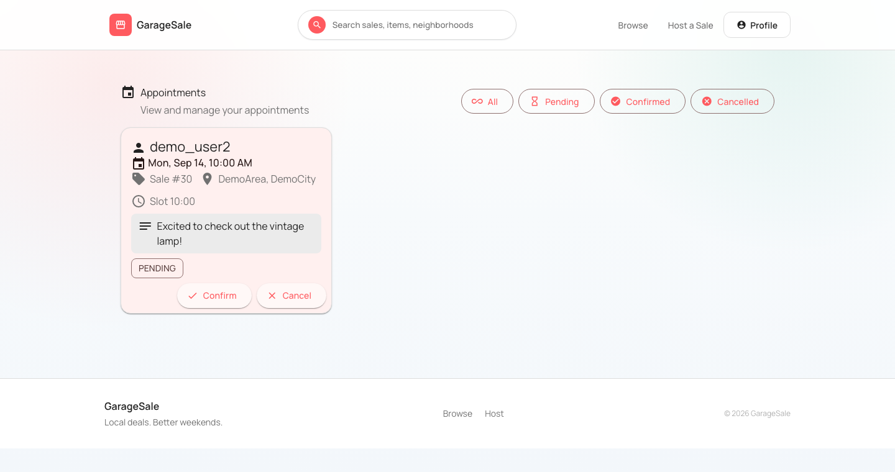
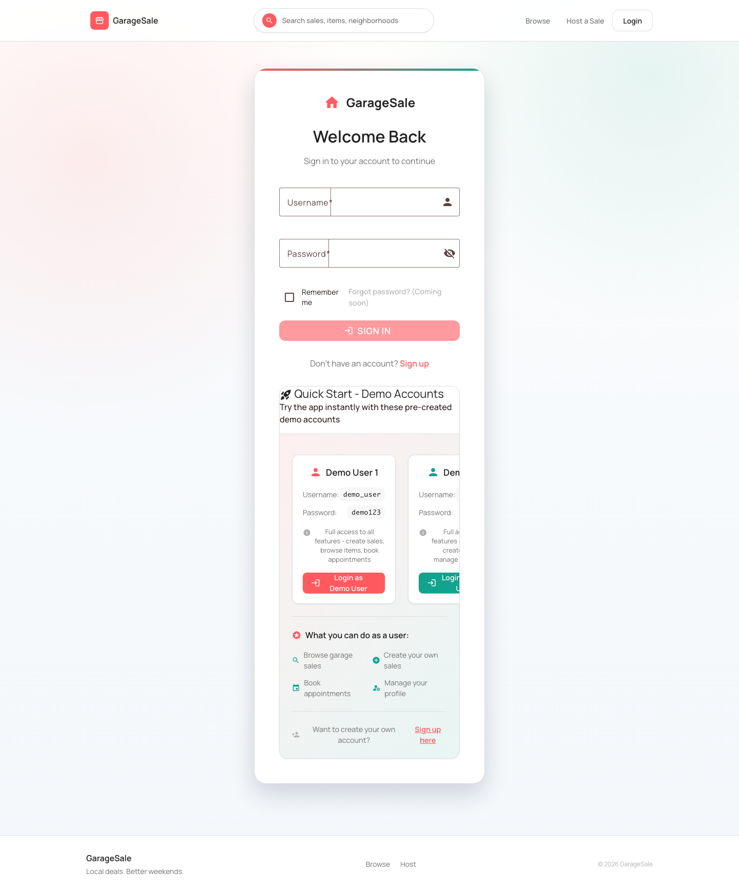

# GarageSale

A neighborhood garage-sale marketplace: **sellers** list a sale with items and photos, **buyers**
discover nearby sales on a list + map, preview items, and **book a visit time slot** — with slot
capacity enforced server-side so a sale never gets overbooked.

[](https://github.com/rebcoder/gs/actions/workflows/ci.yml)
[](LICENSE)
[](gs-front)
[](gs-back)

<p align="center">
  
  
</p>

## Features

**Buyer**
- Discover sales with filters (query, date, category, distance, price) and map markers
- View a sale's gallery, item list, and item detail preview
- Save items to a local "visit list" planner
- Book a visit appointment — slot capacity enforced backend-side, live "slots left" indicator
- Track appointment status (pending / confirmed / cancelled)

**Seller**
- Create and manage a sale (date, open hours, location, per-slot visitor capacity)
- Add, update, and remove items — with optional image upload
- Review incoming appointments for each sale and confirm/reject them

<p align="center">
  
  
  
</p>

## Tech Stack

| | |
|---|---|
| **Backend** | Java 17 · Spring Boot 3.3 (Web, Security, Data JPA, Validation, Cache) · JWT auth · PostgreSQL + Redis (H2 in-memory for zero-setup local dev) |
| **Frontend** | Angular 20 (standalone components) · Angular Material · Tailwind CSS v4 · Leaflet |
| **Testing** | JUnit + Mockito (backend) · Karma/Jasmine (frontend unit) · Playwright (frontend E2E) |
| **Tooling** | Docker Compose, GitHub Actions CI |

## Quick Start

**Prerequisites:** Docker Desktop, Node.js 18+.

```bash
# 1. Backend (Spring Boot + Postgres + Redis via Docker Compose)
docker compose up --build -d gs-back

# 2. Frontend
cd gs-front
npm ci
npm start
```

Open **http://localhost:4200**. Verify the backend is healthy: `curl http://localhost:8081/api/test/health`
(expect `Backend is running!`).

### Try it with demo data

```bash
curl -X POST http://localhost:8081/api/test/seed-demo
```

Then log in with a seeded local-only demo account (also available as one-click buttons on the login
page) — these only exist when running outside the `prod` Spring profile:

| Username | Password |
|---|---|
| `demo_user` | `demo123` |
| `demo_user2` | `demo123` |

<p align="center">
  
</p>

### Stop everything

```bash
docker compose down   # backend + Postgres + Redis
# Ctrl+C the frontend terminal
```

## Testing

```bash
cd gs-back && ./mvnw test                                              # backend unit/integration tests
cd gs-front && npm test                                                # frontend unit tests
cd gs-front && npm run e2e                                             # full-journey E2E (backend must be running)
./test_appointment_booking.sh                                          # API smoke script
```

See [`docs/TESTING.md`](docs/TESTING.md) for the full breakdown.

## Project Structure

```
gs/
├── gs-back/    Spring Boot REST API (port 8081)
├── gs-front/   Angular SPA (dev server port 4200)
│   └── e2e/    Playwright end-to-end tests
├── docker-compose.yml
└── docs/       architecture, testing, known issues
```

## Documentation

- [`AGENTS.md`](AGENTS.md) — quick-start context (also useful for AI coding agents)
- [`docs/ARCHITECTURE.md`](docs/ARCHITECTURE.md) — layering, domain model, API reference, config
- [`docs/TESTING.md`](docs/TESTING.md) — test inventory and how to run everything
- [`docs/KNOWN_ISSUES.md`](docs/KNOWN_ISSUES.md) — known gaps, honestly
- [`CHANGELOG.md`](CHANGELOG.md)

## Project Status

Open-source and portfolio-style — built to run locally (Docker Compose + `npm start`), not deployed
anywhere. `gs-back/Dockerfile` produces a standalone image if you want to self-host it yourself.

## Contributing

Contributions welcome — see [`CONTRIBUTING.md`](CONTRIBUTING.md). Please review
[`CODE_OF_CONDUCT.md`](CODE_OF_CONDUCT.md) and report security issues per [`SECURITY.md`](SECURITY.md)
rather than as public issues.

## License

[MIT](LICENSE)
